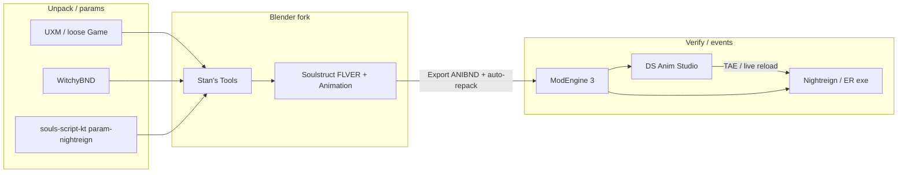

# Stan's Tools — Nightreign / ER Animator Workflow

End-to-end notes for the **team-cereus `soulstruct-blender` fork**: what we built, which
external tools plug in, and how this differs from the classic DSAS → Max → HCT pipeline.

Companion docs:

| Doc | Location |
|-----|----------|
| ER/NR Havok + export depth | [`DEV_ER_ANIMATION.md`](../DEV_ER_ANIMATION.md) |
| DSAS workspace + viewport quirks | Example: `projects/ssb_nr_artorias/DSAS_SETUP.md` on your machine |
| Param / regulation lessons | `souls-script-kt/docs/guides/er-nr-animation-modding-workflow.md` |
| Souls Modding Wiki index | `souls-script-kt/discydump/` |

---

## 1. Tool chain (what each piece does)



| Tool | Role in **our** workflow | Paths / notes |
|------|-------------------------|---------------|
| **UXM** (or ME3 loose files) | Unpacked `Game/chr/*.chrbnd.dcx`, `*.anibnd.dcx` on disk | Game Root in Blender |
| **WitchyBND** | Unpack/repack BND/DCX when not using Soulstruct writeback | [ividyon/WitchyBND](https://github.com/ividyon/WitchyBND) — not Yabber |
| **Soulstruct for Blender** (team-cereus fork) | FLVER import, HK2018 animation import/export, ANIBND writeback | `S:\_modding\tools\soulstruct-blender` |
| **Stan's Tools** (addon tab) | Search characters, NPC mesh variants, animation search, mod folder, game auto-detect | `io_soulstruct/.../stan_tools/` |
| **souls-script-kt** | `NpcParam.param.xml`, character name JSON generation, `.nr.kts` param mods (separate from animation) | `param-nightreign/regulation-bin/` |
| **Smithbox / Witchy** | Param **editing** if not using Kotlin scripts | Wiki: use Smithbox, not Yapped |
| **DSAS** (DS Anim Studio) | TAE events (SFX, hitboxes, i-frames), viewport preview, **in-game live reload** | `S:\_modding\tools\DSAnimStudio` |
| **ModEngine 3** | Loads `Game/mod/` overrides | Mod Folder = `...\Game\mod` |
| **Aqua Toolset** | Optional FLVER→FBX if not using Blender mesh import | Legacy path in wiki tutorials |
| **HavokMax / HCT 2018** | Reference + version conversion in **old** tutorials; fork uses `CompressAnim.exe` for export | See `DEV_ER_ANIMATION.md` §7 |

---

## 2. Fork capabilities (team-cereus `soulstruct-blender`)

### What works today (ER + Nightreign)

| Feature | Status | Implementation |
|---------|--------|----------------|
| FLVER + armature import | ✅ | `flver/`, `FLVERVersion.Nightreign` |
| Character ANIBND → Blender action | ✅ | `eldenring.AnimationHKX` / `SkeletonHKX`, HK2018 + compendium |
| Character ANIBND export + spline compression | ✅ | `CompressAnim.exe` in soulstruct-havok |
| **Multi-div ANIBND** (e.g. `c4900` Caligo) | ✅ | Per-entry compendium pick (`hkx_div00` / `div01` / `div02`) |
| **Stan's Tools** UI | ✅ | Sidebar tab **Stan's Tools** |
| Nightreign in Game enum | ✅ | Setup + auto-detect Steam path |
| Auto-repack ANIBND to mod folder | ✅ | `animation_export_settings.auto_repack_to_mod` |
| NPC Param mesh visibility (DSAS-like) | ✅ | Split by `#00#`–`#31#` materials + `NpcParam` draw masks |
| Asset / MSB / collision | ⚠️ | Unchanged upstream scope |
| In-game hot reload **from Blender** | ❌ | See §6 — use DSAS |

### Submodule layout (development)

```
soulstruct-blender/
├── io_soulstruct/soulstruct/blender/     # Addon (UI, operators, stan_tools)
├── io_soulstruct_lib/
│   ├── soulstruct/                       # team-cereus fork — Binder aliases, NR constants
│   └── soulstruct-havok/                 # team-cereus/soulstruct-havok (upstream Grimrukh) — HK2018, CompressAnim
├── DEV_ER_ANIMATION.md
└── docs/STAN_TOOLS_WORKFLOW.md           # this file
```

Blender install via **junctions** to `%APPDATA%\...\scripts\addons\io_soulstruct` (+ `io_soulstruct_lib`). See `DEV_ER_ANIMATION.md` §2.

### Binder compat fix (required for ER ANIBND)

`soulstruct-havok` expects `find_entry_matching_name` / `find_entries_matching_name` on `Binder`. The team-cereus `soulstruct` fork adds aliases over `find_entry_by_name_regex`. Without this, animation import fails on compendium lookup.

---

## 3. Stan's Tools — UI map

Open **3D Viewport → N → Stan's Tools** (not the top menu bar).

### Setup

| Control | Purpose |
|---------|---------|
| **Game** | Pick **Elden Ring: Nightreign** (or Elden Ring) |
| **Auto-Detect Game Directory** | Steam library scan → sets Game Root (+ default Mod Folder) |
| **Game Root** | Unpacked `...\NIGHTREIGN\Game` (must contain `chr\`) |
| **Project Root** | Optional workspace mirroring game layout |
| **Mod Folder** | `...\Game\mod` for ModEngine |
| **NpcParam XML** | Witchy `NpcParam.param.xml` (e.g. from `souls-script-kt/param-nightreign/regulation-bin/`) |
| **Prefer import from project** | Standard Soulstruct setting |
| **Auto-Repack to Mod Folder** | After animation export, copy `c####.anibnd.dcx` → `mod/chr/` |

### Characters

| Control | Purpose |
|---------|---------|
| **Search Character by Name** | Imports **CHRBND only** (no animation yet) |
| **Load Character Animation** | Search popup over active character's ANIBND clips |
| **NPC Param** dropdown | Picks NpcParam row for this `c####` |
| **Apply NPC Param Visibility** | Re-run mesh split / visibility if needed |
| **Show All Meshes** | Ignore draw masks temporarily |
| **Refresh** (icon) | Reload NpcParam list from XML |

**NPC Param behavior:** Changing the dropdown **applies visibility immediately** (DSAS Entity-tab style). Import does **not** run the heavy mesh split automatically — pick a row when you need the correct parts visible.

### Animation

Same as **Animation** tab: **Export Character Animation**, frame range options, etc.

---

## 4. Recommended workflow (Blender-first)

### One-time setup

1. Unpack NR/ER `Game` (UXM) or play with ME3 loose files.
2. Enable Soulstruct addon (junctions + pip bootstrap on first enable).
3. **Stan's Tools → Setup:** game, Game Root, Mod Folder, optional Project Root, NpcParam XML path.
4. Optional: copy `regulation-bin/NpcParam.param.xml` under Project Root for auto-discovery.

### Per character (e.g. Artorias `c7720`, Caligo `c4900`)

1. **Search Character by Name** → select `c7720` / `c4900` / etc.
2. **NPC Param** → select variant row (mesh parts update on selection).
3. Select armature → **Load Character Animation** → pick clip (e.g. `a000_003023`).
4. Edit action in Blender (30 fps, 1 frame = 1 game sample).
5. **Export Character Animation** with **Auto-Repack to Mod Folder**.
6. **DSAS:** open project ANIBND, edit **TAE** if needed; use viewport with `_DSAS_WORKSPACE.json` pointing at Game + ModEngine (see DSAS_SETUP.md).
7. **In-game:** ME3 + spawn character; reload motion via DSAS **Force Ingame Entity Reload** (§6).

### Character display names

Bundled JSON: `io_soulstruct/soulstruct/blender/general/character_names/`

- Generated from Paramdex (+ NR merge) via souls-script-kt:

```bash
# from souls-script-kt repo root
python scripts/tools/gen-character-names.py
```

- Per-machine fixes: `overrides.json` in the same folder (`"7720": "Knight Artorias"`).

---

## 5. NPC mesh visibility (DSAS vs Blender)

**DSAS:** One rigged mesh; `NpcParam.modelDispMask0`–`31` control which submeshes **draw** at runtime.

**Blender:** Import merges submeshes into **one skinned mesh**. Stan's Tools splits by material display-mask tag (`#00#`–`#31#` in material names) into child meshes so you can hide parts without breaking the rig.

Technical notes:

- Split uses **polygon extraction + vertex group copy** (not `mesh.separate(MATERIAL)`, which broke skinning).
- Blender **5.1:** no `bmesh.ops.delete_loose` — custom loose-vert cleanup.
- Source mesh stays hidden with armature modifier disabled; visible parts deform normally.
- Re-apply NPC Param after addon reload to rebuild splits (version tag on armature).

Requires Witchy **NpcParam.param.xml**, not `regulation.bin` inside Blender.

---

## 6. Hot reload — DSAS vs Blender

Two different meanings:

| Term | Meaning |
|------|---------|
| **Blender Reload Scripts** (F3) | Reload **addon Python** after code changes. Does not affect the game. |
| **DSAS Live Refresh** | **In-game** reload of chr/object files via **process memory injection** |

### How DSAS live refresh works

1. Save ANIBND (optionally **Live Refresh On Save** in DSAS config).
2. Files must already be on disk under ModEngine `Game\mod\chr\` (Blender **auto-repack** does this).
3. DSAS `LiveRefresh()` → attach to `eldenring` / `start_protected_game` → scan AOBs from `install\Res\IngameReload_ER.ini` → inject shellcode with chr id (e.g. `c7720`).

**Requirements:** game running; matching entity spawned; **EAC off**; often admin; correct game version AOBs.

**Not implemented in Stan's Tools** — porting would mean duplicating `DSAnimStudioNETCore/LiveRefresh/*` (Win32 injection, per-patch AOB maintenance). Practical approach: export from Blender → open DSAS → **File → Force Ingame Entity Reload Now** or enable **Live Refresh On Save** while editing TAE.

### DSAS viewport vs File → Open

- **File → Open** = project ANIBND for editing/saving.
- **3D viewer** reads `Game\mod\chr\c####.anibnd.dcx` **first**, then vanilla — stale mod file = wrong motion until you copy fresh export and **restart DSAS** (caching).

See `DSAS_SETUP.md` for `_DSAS_WORKSPACE.json` fields.

---

## 7. Multi-div ANIBND (Caligo `c4900` and similar)

Some characters ship **multiple Havok divisions** in one ANIBND:

- `hkx_div00_compendium\c4900_div00.compendium`
- `hkx_div01_compendium\c4900_div01.compendium`
- `hkx_div02_compendium\c4900_div02.compendium`

The fork resolves **which compendium** to use from each clip's binder path (and skeleton path for rig import). **Load Character Animation** and animation search work for these binders after the `resolve_compendium_entry()` fix in `animation/utilities.py`.

---

## 8. souls-script-kt integration

| Artifact | Used by |
|----------|---------|
| `param-nightreign/regulation-bin/NpcParam.param.xml` | Stan's Tools NPC Param list + draw masks |
| `configs/paramdex/NR/` | `gen-character-names.py` labels |
| `scripts/tools/gen-character-names.py` | Regenerate `character_names/*.json` in addon |
| `.nr.kts` mods | Gameplay params — **orthogonal** to animation export unless you also ship param mods |

Nightreign regulation **decrypt** is not in Blender; use pre-dumped Witchy XML from the repo or your own Smithbox/Witchy export.

---

## 9. Troubleshooting

| Symptom | Likely cause | Fix |
|---------|----------------|-----|
| Character search empty | No `chr\` under Game/Project root | Set Game Root to unpacked `...\Game` |
| Load Animation greyed out | No armature / wrong object | Import character first; select armature |
| `Found multiple Binder entries matching '.*\.compendium'` | Multi-div ANIBND | Update fork (`resolve_compendium_entry`) |
| Rig moves, mesh static | Mask split without vertex groups | Re-apply NPC Param (split v4+) |
| Import freezes | Old auto-apply split on huge mesh | Update fork; import no longer auto-splits |
| DSAS shows vanilla motion | Mod ANIBND not in `Game\mod\chr\` or DSAS cache | Auto-repack; restart DSAS |
| Live reload fails | EAC, wrong process, no admin | DSAS error toast; use ME3 without EAC |
| Export fails CompressAnim | Missing bundled exe | `soulstruct-havok/havok/resources/CompressAnim.exe` |
| NPC Param empty | XML path wrong | Setup → NpcParam XML or `Project/regulation-bin/` |

---

## 10. Commits / history (fork)

Notable addon work on `soulstruct-blender` `main`:

- `c7412d2` — Stan's Tools sidebar (character search, animation search, mod root, auto-repack).
- `13e5504` — NPC mesh visibility (skinning-safe split), multi-div compendium, NPC apply-on-select.

Upstream Grimrukh addon remains the base; ER/NR animation export/import and Stan's Tools are **fork-only** until merged upstream.

---

## 11. Quick command reference

Example paths below are **optional** — substitute your clone location and Blender version.

```powershell
# Blender junctions (see DEV_ER_ANIMATION.md)
# Example (this machine):
$addons = "$env:APPDATA\Blender Foundation\Blender\5.1\scripts\addons"
cmd /c mklink /J "$addons\io_soulstruct"     "S:\_modding\tools\soulstruct-blender\io_soulstruct"
cmd /c mklink /J "$addons\io_soulstruct_lib" "S:\_modding\tools\soulstruct-blender\io_soulstruct_lib"

# Background smoke test (Artorias)
& 'C:\Program Files\Blender Foundation\Blender 5.1\blender.exe' `
  --background --factory-startup `
  --python 'S:\_modding\tools\soulstruct-blender\scripts\blender_test_nr_c7720_anim.py'

# Regenerate character search names
cd S:\souls-script-kt
python scripts/tools/gen-character-names.py
```

Reload addon after pulling: **F3 → Reload Scripts** for `soulstruct.blender.*` only; restart Blender after `soulstruct` / `soulstruct-havok` submodule changes.
